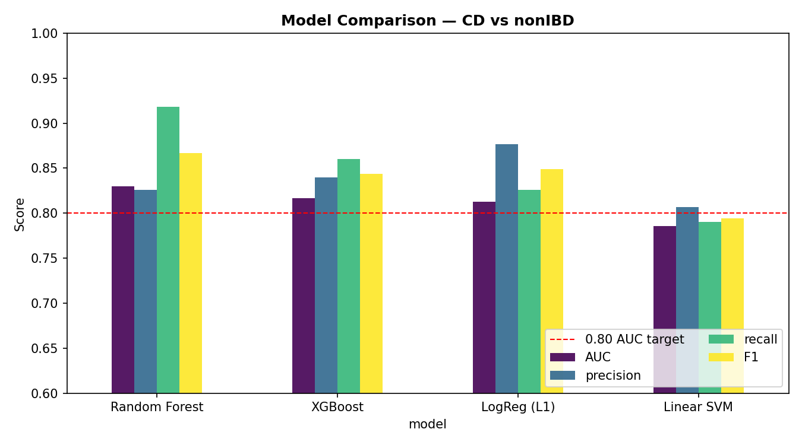
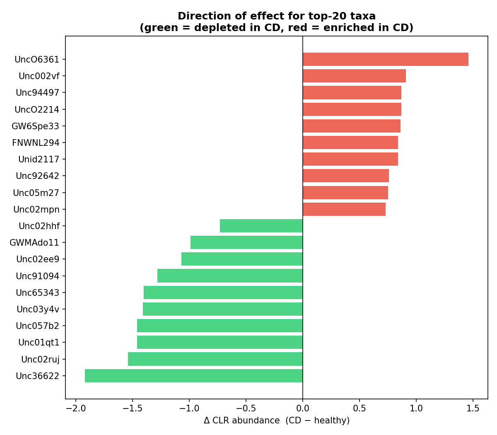

# What my gut bacteria say about Crohn's disease — and the mistake that almost fooled me

*A machine-learning walk through the HMP2 microbiome dataset, written for people who know Python
but not biology.*

---

## The gut, in two paragraphs

Your large intestine is home to trillions of bacteria — hundreds of species living in a balance
that helps digest food, train your immune system, and keep inflammation in check. Collectively
they're called the **gut microbiome**. When that community gets knocked out of balance, the medical
term is *dysbiosis*, and it shows up alongside a lot of disease.

**Crohn's disease** is one of those. It's a form of inflammatory bowel disease (IBD) where the
immune system attacks the gut, causing chronic inflammation, pain, and damage. It's driven mostly
by genetics and immune dysregulation — but the microbiome looks different in Crohn's patients too.
That raises an obvious data-science question: **if I sequence someone's gut bacteria, can I tell
whether they have Crohn's?** And if I can, *which* bacteria give it away?

## The data

I used the **HMP2 / iHMP IBD cohort** ([ibdmdb.org](https://ibdmdb.org/)) — a study that collected
stool samples from people with Crohn's, ulcerative colitis, and healthy controls, repeatedly, over
time. After joining the 16S rRNA bacterial profiles to the clinical metadata I had **178 samples ×
982 bacterial taxa**, labelled CD / UC / healthy. My main task: **Crohn's vs healthy** (132
samples).

Two things make this data awkward for ordinary ML:

1. **It's 91.7% zeros.** Most bacteria appear in almost no samples. I filtered to taxa present in
   >10% of samples (982 → ~180).
2. **It's compositional.** Sequencing only tells you *relative* abundances — the total is an
   arbitrary number set by how deep you sequenced. Feeding raw proportions to a model creates fake
   correlations. The standard fix is the **centered log-ratio (CLR)** transform, which re-expresses
   each sample as log-ratios against its own geometric mean. After CLR, ordinary classifiers behave.

## A first model that looked great

I trained a Random Forest (and XGBoost, L1 logistic regression, a linear SVM for comparison) to
classify CD vs healthy, scoring with **AUC** — the probability the model ranks a random Crohn's
sample above a random healthy one, where 0.5 is a coin flip and 1.0 is perfect.

Random Forest led at **AUC ≈ 0.83**, comfortably past the 0.80 I'd hoped for. Time to celebrate?

## The mistake that almost fooled me

Not yet. HMP2 is **longitudinal** — the same patient shows up at multiple visits. My
cross-validation was shuffling *samples*, which meant a patient's January visit could be in the
training set while their March visit was in the test set. The model wasn't only learning "what
Crohn's looks like" — it was partly learning **to recognise specific people**, then being graded on
those same people. That inflates the score.

The fix is to split **by patient** (`GroupKFold`), so every test patient is someone the model has
never seen — which is the only question that matters clinically. Here's what honesty costs:

AUC fell from ~0.83 to **~0.68**. The first number was real, but it was measuring the wrong thing.
The 0.68 is the honest answer: from a single stool sample, a model can tell Crohn's from healthy
*meaningfully better than chance, but it's no stand-alone diagnostic.* This patient-leakage trap is
one of the most common ways microbiome-ML results get oversold — catching it is, to me, the most
valuable result in the whole project.

## What the model actually keyed on

So there's a real (if modest) signal. Where does it come from? I used **SHAP** to ask each taxon
how much, and in which direction, it pushed predictions.

The pattern is striking: **the five most important bacteria are all *depleted* in Crohn's.** The
model's main evidence isn't some invading pathogen — it's the **absence** of bacteria that are
normally there. That lines up with the community-level view: Crohn's samples had significantly
**lower diversity** (a Shannon score of 2.44 vs 2.78 in healthy guts, p = 0.007). Losing
health-associated commensals *is* the signal.

This is exactly the textbook story of IBD — the loss of beneficial, butyrate-producing gut
commensals — and the model rediscovered it without being told any biology. (One honest caveat: this
dataset labels bacteria with opaque reference IDs and most are *uncultured* organisms with no
species name, so I can describe the *pattern* confidently but can't put a Latin name on each bug.)

## Why it matters

Two takeaways, one biological and one methodological:

- **Biologically:** Crohn's looks less like an infection and more like an *erosion* — a thinning of
  the normal microbial community. A microbiome profile is a useful **correlate** of the disease,
  not a replacement for clinical diagnosis, and the data says so honestly.
- **Methodologically:** the most important number in a machine-learning project is often the one
  you get *after* you stop letting the model cheat. The same 178 samples gave me 0.83 or 0.68
  depending entirely on how I split them. Knowing which to believe is the actual skill.

*Code, data, and the full notebooks are on [GitHub](https://github.com/liamc0004/crohns-microbiome-ml).*
