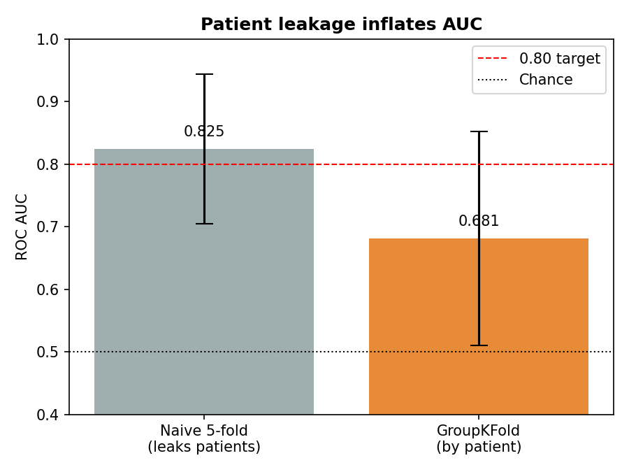

# crohns-microbiome-ml

Can a single stool-sample microbiome profile tell Crohn's disease from a healthy gut — and *how
honestly* can we measure that? This project builds an interpretable machine-learning pipeline on
the HMP2 IBD cohort, then stress-tests its own results against the trap that sinks most
microbiome-ML projects: patient-level data leakage.

**Stack:** Python · scikit-learn · XGBoost · SHAP · UMAP · pandas · Jupyter

---

## Key findings

- **A 16S snapshot separates Crohn's from healthy above chance — but modestly.** Naive
  cross-validation suggests AUC ≈ 0.83; once samples are split **by patient** (`GroupKFold`), the
  honest AUC for an *unseen* patient is **≈ 0.68**. The gap is patient leakage, and reporting the
  0.68 is the point.
- **The signal is depletion, not invasion.** The five most important taxa are all *depleted* in
  Crohn's — the model keys on the **absence of health-associated commensals**, mirroring the
  significant drop in community diversity (Shannon 2.44 vs 2.78 in healthy, Mann-Whitney p = 0.007).
  This independently recovers the well-established commensal-depletion signature of IBD.
- **Microbiome as correlate, not diagnostic.** The broad, modest signal fits the biology: IBD is
  driven by host genetics and immunity that the microbiome only partly reflects.

| Evaluation | ROC AUC (CD vs healthy) |
|---|---|
| Naive 5-fold (leaks patients) | ~0.83 |
| **GroupKFold by patient (honest)** | **~0.68** |



---

## Notebooks

Read in order; each runs top-to-bottom on a fresh kernel.

| Notebook | What it covers |
|---|---|
| `01_exploration.ipynb` | EDA, CLR transform, alpha/beta diversity, UMAP, RF baseline, SHAP, a CoRF experiment |
| `03_modeling.ipynb` | Data-quality decisions (low-read samples, class imbalance, compositional method); 4-model comparison with ROC curves |
| `04_longitudinal.ipynb` | Repeated-measures structure, diversity trajectories, disease-activity analysis, and the patient-level leakage result |
| `05_interpretation.ipynb` | SHAP ranking, direction-of-effect per taxon, biological narrative, naming limitation |

Shared preprocessing lives in `src/microbiome.py`. Full rationale is in [`METHODS.md`](METHODS.md).

---

## Dataset

**HMP2 / iHMP IBD cohort** — [ibdmdb.org](https://ibdmdb.org/). The longitudinal IBD study
provides stool 16S rRNA taxonomic profiles and clinical metadata for Crohn's disease, ulcerative
colitis, and healthy controls. Here: 982 taxa × 178 samples (86 CD, 46 UC, 46 nonIBD); the primary
task is CD vs nonIBD (132 samples).

> Lloyd-Price, J., Arze, C., Ananthakrishnan, A. et al. *Multi-omics of the gut microbial ecosystem
> in inflammatory bowel diseases.* Nature 569, 655–662 (2019).

**Note on taxa names:** the 16S table labels taxa with Greengenes-derived OTU ids (`Unc03y4v`, …),
most of them uncultured organisms with no species name. Interpretation is at the level of
importance and direction of effect, not Linnaean identity — see [`METHODS.md`](METHODS.md).

---

## Reproduce

```bash
git clone https://github.com/liamc0004/crohns-microbiome-ml.git
cd crohns-microbiome-ml
python -m venv venv
source venv/bin/activate
pip install -r requirements.txt
jupyter lab          # then run notebooks 01, 03, 04, 05 in order
```

The dataset is committed under `data/`, so the notebooks run without any download.

---

## Project structure

```
crohns-microbiome-ml/
├── data/                     # HMP2 metadata + 16S taxonomic profiles (committed)
├── src/microbiome.py         # shared load + CLR preprocessing pipeline
├── notebooks/                # 01 exploration · 03 modeling · 04 longitudinal · 05 interpretation
├── figures/                  # all generated figures (referenced in notebooks + this README)
├── METHODS.md                # preprocessing & modeling decisions, with rationale
├── 2month_roadmap.md         # project roadmap
├── problems_log.md           # issues hit and how they were resolved
└── requirements.txt
```
